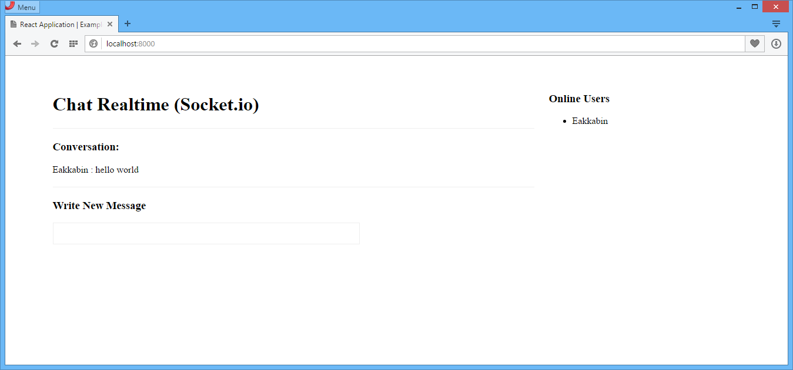

# react-realtime-chat
React Application | Chat Realtime

# install
- npm install webpack webpack-dev-server nodemon -g
- npm install --save

# start socket.io (server)
- nodemon server.js
- http://localhost:8001/

# start react (client)
- npm start
- http://localhost:8000/

# demo
